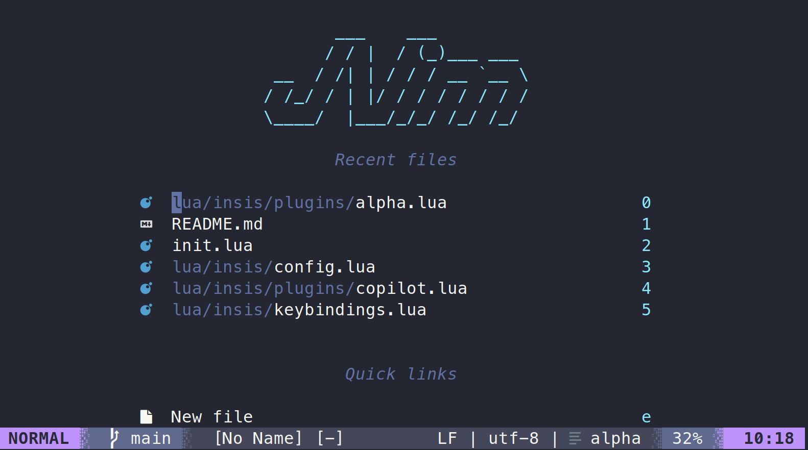

# JVim

My customized Neovim IDE solution.

## Dependencies

For current version, neovim `v0.10.4` is used.

## Developer Note

- **_Copilot_** is working but only basic feature is available. More hotkeys are expected to be added.
