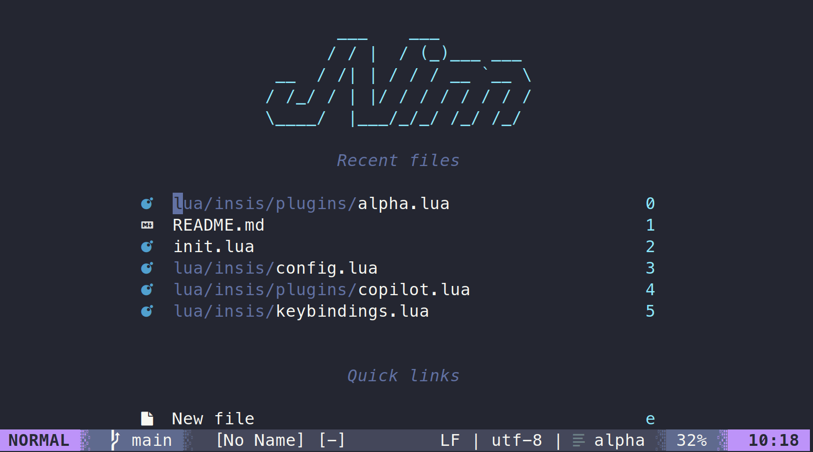

# JVim

My customized version of InsisVim, a Neovim IDE solution.

## Dependencies

For current version, neovim `v0.10.4` is used.

## Developer Note

- **_Copilot_** is working but only basic feature is available. More hotkeys are expected to be added.
  - It is also required to install node.js `>22.0`. For fish shell, run `fisher install jorgebucaran/nvm.fish` to use `nvm` command when installing new version of node.js
